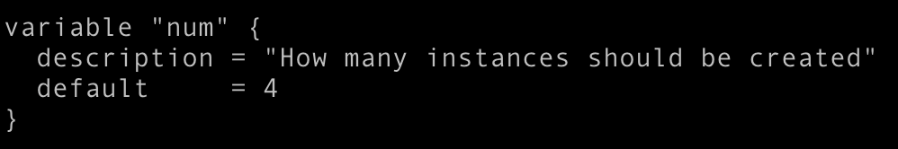

# 성능 테스트

<br>

- 서비스 출시전에 해당 서비스가 어느 정도의 안정성을 가질 수 있는지를 위한 테스트

    - 성능 테스트/부하 테스트/스트레스 테스트

- 성능 테스트
    - 해당 서비스가 어느 정도의 성능을 내는지를 알아보는 테스트
        - ex) 성능이 1000TPS 정도 된다

    <aside>
    💡 TPS: 단위 시간안에 이 시스템이 최대한 처리할 수 있는 트랜잭션의 개수
    </aside>

- 부하 테스트
    - 해당 서비스의 어느 부분에서 어느정도 부하가 걸리는 지를 알아보는 테스트
        - ex) 어느 함수에서 시간이 오래 걸린다

- 스트레스 테스트
    - 성능 테스트/부하 테스트가 특정 시간 이상 지속적으로 안정적으로 되는지 확인하는 테스트(하루, 일주일 등)


<br>

### 성능 테스트 시에 주의 할 점

**주요 시나리오를 테스트 하는지?**

- 단순히 api하나만 호출하는 것이 아니라, 실제 서비스에 사용되는 패턴으로 테스트가 필요하다.
    - API마다 부하의 종류가 다르다.
    - 여러 api의 조합이 필요할 수도 있다.

**클라이언트의 성능 한계를 확인 한다.**

- 부하를 주는 클라리언트의 한계로 인해서 성능 측정이 어려울 수 있으므로, 클라이언트를 점점 늘리면서 테스트 해야 한다.
  
    ex) 대상 서버는 메모리 10기가에 cpu 4개인데, 부하를 주는건 메모리 100메가에 cpu 0.5개면 성능 테스트가 무의미 하다.
    

<br>

### **성능 테스트시에 확인할 부분**

OS 에서 설정하는 값들에 대한 확인이 필요하다.

- ulimit -a : 값 튜닝 필요
    - Open Files : os에서 열 수 있는 파일의 갯수
        - 소켓도 파일. 렛으로 접속..? 소켓이 작으면 일정이상을 못열게 된다. 
        aws는 사양에 따라 다르게 설정되어있다. 
        t2asmall은 1024개가 열려있다 < tcp버퍼부터 시작해서 이런게 다 사양 조절이되는것.
        
        <aside>
        💡 소켓(Socket)이란 네트워크상에서 동작하는 프로그램 간 통신의 종착점(Endpoint). 
        즉, 프로그램이 네트워크에서 데이터를 통신할 수 있도록 연결해주는 연결부라고 할 수 있다.
        데이터를 통신할 수 있도록 해주는 연결부이기 때문에 통신할 두 프로그램(Client, Server) 모두에 소켓이 생성되야 한다.
        [출처]https://medium.com/@su_bak/term-socket%EC%9D%B4%EB%9E%80-7ca7963617ff
        
        </aside>
        
    - Max User Processes : 단일 유저가 사용 가능한 프로세스의 최대 갯수

<aside>
💡 ulimit는 유저가(쉘, 프로세스)에 대해서 할당할 자원의 한계를 정하는 것으로
다중 프로그램/사용자를 기본으로 하는 리눅스 시스템에서 과부하를 막아주는 설정이다. 
[출처] [Linux] ulimit 설정과 openfile 개수|작성자 juner84

</aside>

- /etc/limits.conf를 수정
- 수정 후에 기본적으로 재시작이 필요하다.

AWS ec2는 재시작 하는 것보다는 사용하는 AMI에 기본적인 설정을 해두고 이를 이용하는 것이 좋다.

<br>

### 성능 테스트 툴

다음과 같은 툴 들이 많이 사용된다.

- Ngrinder : 우리가 사용할 테스트 : 네이버에서 성능 측정 목적으로 jython(JVM위에서 파이썬이 동작)으로 개발 된 오픈소스 프로젝트
- Locust
- JMeter
- Gatling
- ab

<br>

### Ngrinder 를 통한 TPS 측정 결과

다음과 같은 정보를 볼 수 있다.

- 평균TPS
- 최대TPS
- 성공 수, 실패 수

Ngrinder는 실패 수가 전체의 30%면 테스트가 끝까지 안가고 실패하게 된다.

<br><br>

# 실습

1. 서버 4대 만들기.  : vi terraform/ec2/ap-northeast-2/[variables.tf](http://variables.tf/) 에서 num 4로 설정



2. terraform init 

3. terraform plan -out "output" : output test 하고 output 파일 만들기

4. terraform apply "output" : aws에서 만들어져있는 걸 확인할 수 있음 키페어 확인, 보안 내 ip 확인

5. vi create_hosts.py : public ips 랑 private ips 바꿔줌 

6. python create_hosts.py: 나오는 ip 리스트 복사

7. aws/hosts

에서!!! 그래도 복사는데, geoip를 scrap으로, ngrinder에서 host4제거. scrap에 host4만 남겨놓기 > 왜냐면 선생님이 그렇게 함

```jsx
[ngrinder]
13.124.110.223 internal_hostname=host1 internal_ip=172.31.3.72
52.78.238.154 internal_hostname=host2 internal_ip=172.31.6.174 ngrinder_master_addr=172.31.3.72:8080
13.125.215.22 internal_hostname=host3 internal_ip=172.31.8.249 ngrinder_master_addr=172.31.3.72:8080
[prometheus]
13.124.110.223 internal_hostname=host1 internal_ip=172.31.3.72
[grafana]
13.124.110.223 internal_hostname=host1 internal_ip=172.31.3.72
[scrap]
13.124.95.13 internal_hostname=host4 internal_ip=172.31.12.155
```

8. ansible-playbook -i aws the_red_1_base.yml

9. ansible-playbook -i aws the_red_2_scrap.yml

10. roles/prometheus/defaults 에 들어가서, main.yml을 내 internal_ip로 수정함

: “ 저번 실습영상 7분 25초 : 그라파나에 default에 main.yml → node 정보 입력하는데가 있는데 있는데 create host에 node 정보 복붙하면 된다.. 걍 만들어준다.. 그 정보를 복붙하면 된다.. “

라고 말하는데 그라파나 아니고 /prometheus 폴더로 들어가야함. python create_hosts.py했을 때 나오는 정보 복붙해서 붙혀넣으면 된다. 


1. ansible-playbook -i aws the_red_1_monitor.yml : 꼭 위의 설정 먼저 해야함
2. 저번 강의 참조, 그라파나 대쉬보드 판넬 만들기: http:request_total 선택 > handler, status 선택 > increase([1m])로 감싸주기


11. ansible-playbook -i aws the_red_1_jdk.yml :jdk 설치

12. ansible-playbook -i aws the_red_3_ngrinder.yml :ngrinder 설치

13. 8080으로 접속.


: 실제로 테스트를 진행하는 건 agent


**ngrinder에서 측정하는 에러와 grafana의 에러 수의 차이 원인**

ngrinder: 아예 network에 접속하지도 못한 에러도 포함

grafana: script 서버가 받아서 에러가 나오는 경우

<br>

tps 를 10개 받을 수 있는데 1000개를 보냇을때 에러도 확인해보심.

<br>

14. vi ~/.ssh/config : 부하확인 위해 서버 접속 

15. ssh r1 

16. top :  Q. cpu, ... 못알아듣겟어 우리 이거 같이 봐보자. 여기서 뭘확인할 수 있는거야


17. /scrap_7002/fastapi/logs : 여기서 에러로그 확인할 수 있음. 이걸 대체 왜 지금 알려주는거야 


socet 파일의 열 수 있는 개수가 한정되어있다. 

근데 늘린다고 해서, 서버가 이것을 처리할 수있냐는 별개의 얘기

18. terraform destroy