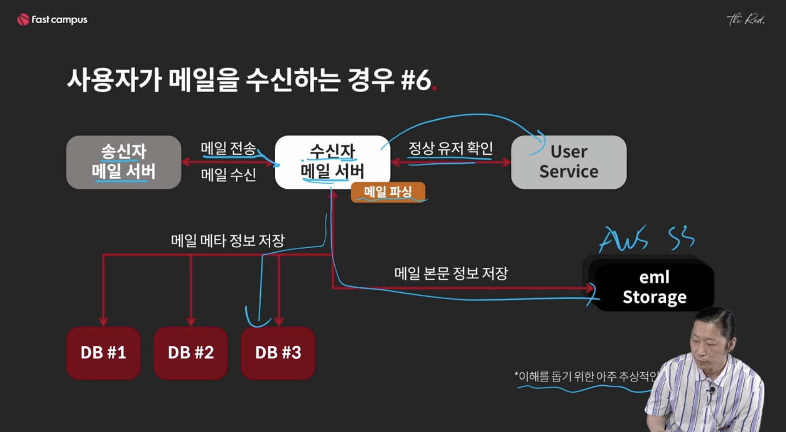

# GUID


## 메일 서비스 설계

- 사용자가 가입하는 경우
- 사용자가 메일을 수신하는 경우
- 사용자가 메일 리스트를 보는 경우
- 사용자가 메일의 상세 내용을 보는 경우

<br/>

### 전체 가정(제약)

- 사용자의 메일 정보 = 사용자의 메일 수신리스트, 각 메일의 실제 파일 내용

- 한 계정의 메일정보는 모두 같은 DB 내에 존재(한 서버에 존재)
- EML을 저장하는 부분은 AWS S3 같은 오브젝트 스토리지를 이용하는 것으로 가정
  - EML : 이메일 메시지를 저장하는 데 사용되는 메일 파일
- 메일 ID만 보고도 어떤 DB 서버에 해당 정보가 있는 지 알 수 있어야 함

<br/>

### 사용자가 가입하는 경우 

### #1

사용자 정보와 사용자 메일의 메타정보는 다른 개념이다

- 사용자 정보: 이메일주소, 가입일, 마지막 로그인 일자, 메일개수
- 사용자 이메일 메타정보: 발신자, 보낸일자, 메일제목, 본문

<br/>

### #2

2억명의 사용자가 있다고 가정

- 각 유저는 1024Byte의 데이터를 사용한다고 가정
- 1024 * 2억 = 약191GB 정도 사용됨 (메모리 용량이 크지X)
- 20%정도가 빈번하게 접근되어도 대략 191*0.2=38.2G로 커버 가능
- 샤딩을 하지 않고 한 서버에서 처리해도 문제 없음
  - 20%정도는 DBMS 내부의 캐시로도 커버 가능함
- 샤딩이 필요해도 Range 샤딩정도로 충분함(2개정도)
  - 보통 256GB를 사용한다면 191GB 정도의 데이터는 메모리에 전부 올라가 있어서 디스크가 많이 사용되지 않음

사용자 유저 DB는 샤딩을 할 정도의 큰 DB가 아니다. 

샤딩을 해야되는 내용은 '사용자 메일의 메타정보'이다. 

<br/>

### 사용자가 메일을 수신하는 경우

### #1 가정

- 수신받는 메일 도메인은 하나로 가정
- 메일 내용(EML)은 DB가 아닌 다른 곳에 저장됨 (Ex. AWS S3)
  - DB에 큰 파일을 저장하는 것은 DBMS의 성능을 저하시킨다. 
  - DB에는 파일의 Path나 URL만 걸어두고 실제정보는 S3, NFS 등에 저장하기
- 메일을 가져가는 방법은 수신받은 시간 순으로만 가져간다고 가정
  - RDB를 쓰면 쉽게 사용할 수 있는 부분
  - NoSQL을 사용하면 Secondary Index를 사용해야 함

<br/>

### #2 메일을 저장하기 위해서는

- 메일 송신자, 메일 제목, 메일받은시간, 실제 파일 내용 등을 DB에 저장

<br/>

### #3 실제 파일 내용을 DB에 저장해야할까?

절대 저장하지 말 것. 일반적으로 대용량 파일이나 첨부파일은 외부에 저장을 하고 해당 링크를 메타정보에 저장해두기

예) sample.jpg / s3://~

<br/>

### #4 메일의 메타데이터에 대략 1024byte를 가정

- 2억명의 유저가 메일을 1000개씩 들고있다면
  - 191*1000 이므로 190TB정도의 데이터가 필요하게 됨
  - DB당 1TB정도의 스토리지를 사용한다면 190개의 샤드가 필요
- 2백만명의 유저가 메일을 1000개씩 들고있다면
  - 1.9TB정도의 스토리지가 필요하고
  - DB당 1TB정도의 스토리지를 사용한다면 2개의 샤드가 필요
- 즉, 사용자의 데이터는 스토리지를 많이 사용하고 샤딩이 필요할 가능성이 높다. 

<br/>

### #5 Mail 테이블 스키마

- Mail_id / Long(64bit) / 유니크 고유아이디
- Receiver / String or Long / 수신자
- Sender / String or Long / 송신자
- Subject / String / 메일제목
- Received_at / timestamp / 수신시간
- eml_id / String or Long / 메일 본문 저장 id (or url)
  - EML 파일 저장위치
- is_read / booleean / 읽음여부
- contents / String / 보여줄 내용의 일부? (중요X)

<br/>

### #6 



<br/>

### #7 EML 저장을 위한 서비스 추가적으로 필요

- 2억명의 유저가 메일을 1000개씩 들고있다고 가정

- 2억명의 유저에 대한 정보를 외부에 저장하려면

- 해당 EML 파일에 대한 key를 무엇으로 잡을 지가 중요. Path를 유티크하게 구성

  - {receiver_id}_{mail_id} 

    ```
    mail_id(auto_incre)만 키로 잡으면
    샤드(DB서버)가 여러개인 구조에서 값이 중복될 수 있음
    즉 샤드전체에서 유일한 키가 아니라 하나의 DB안에서만 유일한 키가 될 여지
    ```

  - 좀 더 좋은 키? 

<br/>

### 사용자가 메일 리스트를 보는 경우

(그림)

<br/>

### 사용자가 메일의 상세 내용을 보는 경우

(그림)

<br/>

## QnA

#### 1) EML ID 필드가 필요한가? (= Receiver_id와 mail_id 필드로 조합하면 되지 않을까)

- 사용해도 무방. 
- 단 스트링이 길어지거나 다른 추가적인 내용을 담을 수 없음
- Mail_id만으로만 구성하지 말 것. 
  - Auto_increment가 설정된 PK로 주로 사용
  - 테이블 내에서만 고유성 보장함
  - 샤드가 여러개면 중복문제

<br/>

#### (참고) 키 설계

- 고유 키를 만드는 방법에는 UUID라는 것이 존재

  ```
  * UUID
  	- 유일성을 보장하는 방법 
  	- 128 bit Integer
  	- String으로 바꾸면 36 characters
  	- 단점?
  		- 하나의 UUID 크기가 너무 크다. (16 bytes)
  		- 시간 정보가 들어가지만 시간 순으로 정렬이 되지 않는다. 
  ```

- 새로운 ID의 필요성!

  - 유일성을 보장
  - 용량 적게 차지 (8 Bytes 정도)
    - 64bits OS에서 디폴트 레지스트리 크기가 8 Bytes
  - ID 만으로 시간의 순서나 생성 시간을 알 수 있어야 함
    - 정렬에 필요
  - 필요한 특정 정보를 담을 수 있으면 좋음

- 시간 정보가 들어가면 ID만으로 시간 정렬이 가능하다. 

<br/>

#### 키설계_#1 

Simple 버전

- 64bit = 8Bytes
- Timestamp (52bits) + sequence (12bits) 조합
- 기존 userid를 생성되는 key와 붙여서 사용하는 방법
- charsyam_6209324585984
  - Timestamp = 6209324585984 >> 12 = 1515948385
    - 언제 만들어졌는 지 ms 기준까지 확인 가능
    - 원래는 mail_id로 메타정보를 읽어와야 create_at으로 알 수 있었지만
    - id만 보고 이 메일의 생성시간을 알 수 있음
  - Sequence = 6209324585984 & 0xFFF = 1024
- 생성 프로세스가 하나일 때만 유일성이 보장된다. 
  - 프로세스 두 개가 동작하면 동일한 키가 생성될 수 있다. 
  - 다른 버전
    - 64bit = 8bytes
    - Timestamp(48bits) + WorkerID(4bits=16) + Sequence(12bits)
      - 42bits를 사용하면 ms 단위로 130년 정도를 사용할 수 있다.. 
    - Worker ID를 해당키를 생성하는 서버에서 설정하면, Worker ID가 다르기 때문에 16대의 KEY 생성 서버에서는 중복이 발생하지 않는다. 

#### 키설계_#2

- Worker ID에 허용된 값만큼의 프로세스 수를 허용한다. 
  - 각 서버는 서로 다른 Worker ID를 가져야만 한다. 
  - 설정실수를하면 중복이 발생할 수 있다.
  - 이 방식은, 시간값 설정해주고 시퀀스를 증가시키는 것만으로 동작하므로 호출해보면 속도가 빠르다. 

<br/>

#### 키설계_#3

- 키 생성 서버를 구축

  (그림)

- 키만 보고 서버를 알 수 있을까?

- 복잡해진 버전

  - Shard 정보가 들어간다. 
  - 64bit = 8bytes
  - Timestamp(40bits) + WorkerID(4bits=16) + shardID(8bits=256) + sequence(12bits=4096개)
  - 조절은 서비스에 맞춰서. 
  - 키를 통해 샤드를 알고 어느DB서버로 갈 지를 알 수 있음
  - shardID가 들어갈 경우의 문제점
    - 개별 유저의 데이터 이동이 불가능하다. 
    - 샤드를 미리 정해놓은 크기만 사용하고 유저 간의 샤드 재배치는 없다 라고 가정할 때만 사용
    - 샤드를 스케일업만 하고 빨리 찾는 것을 목적으로 할 때 사용

- 예) 트위터ID 

  - snowflake ID체계 방식 사용. 가장 유명한 방식
  - Timestamp (42bits)
    - 136년간 사용가능
  - Datacenter ID (5bits)
    - 전세계 데이터 센터가 있는 것으로 유추
    - 미국서부, 미국동부, 유럽, 싱가폴, .. 구역을 나눠놓음
    - 2의5승 = 32개 구역 존재
  - Worker ID (5bits)
    - 32개만큼 워커를 할당 가능 
  - sequence (12bits)
    - 4096까지 사용하고 
    - 0이 되기 전에 sleep을 걸어서 timestamp를 바꿔버림
    - timestamp가 바꼈으면 다시 0부터 시작해서 저장(안바뀐경우 sleep 대기)

- 예) 인스타그램 ID

  - Timestamp (41bits)
    - 64년정도 사용가능
  - Logical Shard ID (13bits)
    - 8192개 사용
  - Auto Increment / 1024 (10bits)
    - DB를 이용해서 키를 만들고있음
    - 생성서버는 1대만 사용. 

- 예) 몽고DB의 ID

  - Timestamp (4bytes)
  - Machine  ID (3bytes)
    - Object id 
  - Process ID (2bytes)
  - Counter (3bytes)

<br/>

#### 우리 서비스에 맞게 키를 설계하면 되고 대신 GUID 서버를 별도롤 사용해야 한다

(그림)

- GUID 서버는 유일한 아이디를 만들어내는 서버
- EML 스토리지의 아이디 뿐 아니라, 
- 고유의 아아디기 필요한 코멘트, 글, 이미지, 좋아요 등도 전부 GUID 서버를 사용해서 만듬 
- 샤딩할 때 편리. 샤딩을 할 때 글로벌로 유니크한 키라는 것을 보장해서 복사할 때 중복X
  - 서버A - 좋아요아이디=1
  - 서버B - 좋아요아이디=1
  - 서버 A, B를 합칠 때? A의 아이디를 B로 옮길 때, 변환작업을 모두 해줘야해서 번거로움
  - 처음부터 GUID를 써서 겹치지 않게 사용하자. 

<br/>

