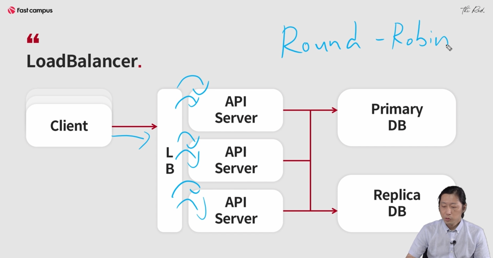

# 로드밸런싱

### LoadBalancer란

: 사용자의 요청을 여러 서버로 분배해주는 하드웨어 or 소프트웨어 장비

  요청자는 LoadBalancer 뒤의 목록은 알지 못한다.



<br><br>

### 소프트웨어 LoadBalancer

:nginx, HaProxy등의 유명한 소프트웨어 LoadBanlencer가 존재한다.


:서비스가 이어지는게 목적

lb는 api server에 지속적인 health_check를 함

<br><br>

### server side vs client side

server side : 하드웨어 사용 

caller → callee : caller는 callee의 갯수를 알 수 없다. 


장점

- 클라이언트가 로드밸런서의 정보만 알면 된다
- 앞에서 배운 로드밸런서를 통해서 리퀘스트를 분산한다.
- 클라이언트가 서버의 개별 주소를 알 필요가 없다.
    - 다만 로드밸런서의 주소를 알아야 한다.
- 실제적으로 한 단계를 더 거치므로 Latency가(지연 대기 시간) 늘어날 수 있다. (다시 갔다가 응답햇다가 돌아온다.) 하드웨어는 빠른데 소프트웨어는 적다..
    - 이를 Hop(홉)이라고 부른다.
    
    <aside>
    💡 다음 네트워크 장비로 패킷이 이동할 때마다 발생하는 카운트
    </aside>
    
- 로드밸런서에 장애가 발생하면 서비스가 더 이상 되지 않는다.


단점 : 콜러가 콜리의 주소를 전부 알아야 한다.

- 클라이언트가 서버의 대수 및 주소를 모두 알아야 한다. : 어떻게?가 문제
- Hop이 존재하지 않으므로 좀 더 빠른 latency를 보여준다.
- 장애포인트가 줄어든다. : 가운데의 lb가 장애가 날리가 없으니까
- 클라이언트에서 서버의 목로과 주소를 관리해야 한다는 단점이 존재한다.
    - 만약 서버들의 주소가 바뀌거나, 서버들의 목록이 추가되거나 삭제된다면?

**: 온프라미스는 하드웨어 로드밸런서가 바깥에 있고 그 안에 nginx를 붙혀서 서버사이드 로드밸런서도 하는게 일반적 → url에 대한 라우팅도 가능하기 때문에**

<br><br>

### 실습

(저번 시간에 이미 해둔 부분)

1. pyenv local the-red-dev
2. pyenv rehash
3. pip install -r requirments.txt

(새롭게 시작) the red 폴더.

1. ./install_program.sh : 주키퍼랑 레디스 설치 : java 8, java11이 깔려있어야함, 주키퍼를 로컬에서 돌리는 것 : 주키퍼를 docker로 올려도됨 : production에서는 3대나 5대 이용해야함
2. cd chapter_2/loadbalancer
3. docker build . -t charsyam/lb_scrap (이름은 원하는 이름으로 하는 것)
4. docker run -e ENDPOINTS=0.0.0.0:7001 -p 7001:7001 charsyam/lb_scrap

docker run -e : 환경변수 설정. 7001과 7001을 연결시켜라, 이미지 이름은 


<도커 지우는 명령어>

1. docker stop {lb_scrap contailner id}

2. doerm rm {lb_scrap contailner id}

3. docker run -e ENDPOINTS=0.0.0.0:7002 -p 7002:7002 charsyam/lb_scrap


<br>

### 소프트웨어 로드밸런서를 이용해서 서버사이드 로드밸런싱을 하는 예제

: 서버 사이드 로드밸런스가 health_check하다가 문제가 있으면 빼버림.

소프트웨어 로드밸런서는 nginx나 haproxy가 다함.  L7레이어에서 하는 로드밸런서. (이젠 L4도 지원함. tcp/udp) 

참고 : [https://prohannah.tistory.com/65](https://prohannah.tistory.com/65)

1. cd the_red/chapter_2/loadbalancer/nginx_conf

(apt get으로 nginx를 가져왔다는 전제하에)

2. sudo cp scrap /etc/nginx/sites-available/            :/etc/nginx/sites-available에 복사

3. cd /etc/nginx/sites-enabled/

4. sudo ln -sf /etc/nginx/sites-available/scrap scrap :sites-available을 링크 걸어주는 것

scrap내용 : backend를 호출하면 7001, 7002로 보내고, 7000번에서 대기함


 : 7000번으로 오면 프록시패스로 전달, 

5. sudo service nginx reload

<br>

### the_red_infra 실습

- aws 의 elb(엘라스틱 로드밸런서)

- 를 이용, 인스턴스가 생성될 때 elb가 자동 생성,  target 그룹이 붙게 된다. auto 스케일링이 붙을 수도 있고 그걸 이용한 loadbalncing을 보여준다. target그룹이 elb랑 연동돼서 target 그룹이 health_check, elb로 오는트래픽을 정상적인 애들한테만 보내줌→ nginx랑 동일한 동작. 다만 elb에서 회복된애들을 체크하고..장애를 체크하는 ..쓰레쓰울드..

1. default num 2로 바꿈 2대 생성
2. terraform init 
3. terraform plan -out "output" : 8개의 변경사항이 생긴다. Plan: 8 to add, 0 to change, 0 to destroy.
4. terraform apply "output" : aws에서 만들어져있는 걸 확인할 수 있음 키페어 확인, 보안 내 ip 확인

geoip_lb_dnsname = "[geoip-lb-449517090.ap-northeast-2.elb.amazonaws.com](http://geoip-lb-449517090.ap-northeast-2.elb.amazonaws.com/)"

5. vi create_hosts.py : public ips 랑 private ips 비꿔줌 

6. python create_hosts.py: 나오는 ip 리스트 복사

```kotlin
[ngrinder]
13.125.119.242 internal_hostname=host1 internal_ip=172.31.11.154
13.124.112.232 internal_hostname=host2 internal_ip=172.31.10.183 ngrinder_master_addr=172.31.11.154:8080
[prometheus]
13.125.119.242 internal_hostname=host1 internal_ip=172.31.11.154
[grafana]
13.125.119.242 internal_hostname=host1 internal_ip=172.31.11.154
[geoip]
13.125.119.242 internal_hostname=host1 internal_ip=172.31.11.154
13.124.112.232 internal_hostname=host2 internal_ip=172.31.10.183
nodes:
- 172.31.11.154:9100
- 172.31.10.183:9100
prometheus_node:
- 172.31.11.154:9090
geoip_nodes:
- 172.31.10.183:7001
```

7. aws/hosts

8. ansible-playbook -i aws the_red_1_base.yml

9. ansible-playbook -i aws the_red_2_geoip.yml

10. 


11. 로드밸런서 주소로 테스트


(한대를 내려보는 테스트를 위해서)

12. sudo vi ~/.ssh/config

13. ps -ef|grep gunicorn :프로세스들 확인가능

14. sudo service gunicorn_geoip_7002 stop


헬스 체크가 아직 안된 상태 : 헬스 체크 주기가 30초로 되어있고, 3번 실패해야 바뀌게끔 설정되어있음 → 적당히 잘 조절하는 것이 중요


15. sudo service gunicorn_geoip_7002 start

16. 다시 health로 돌아옴

