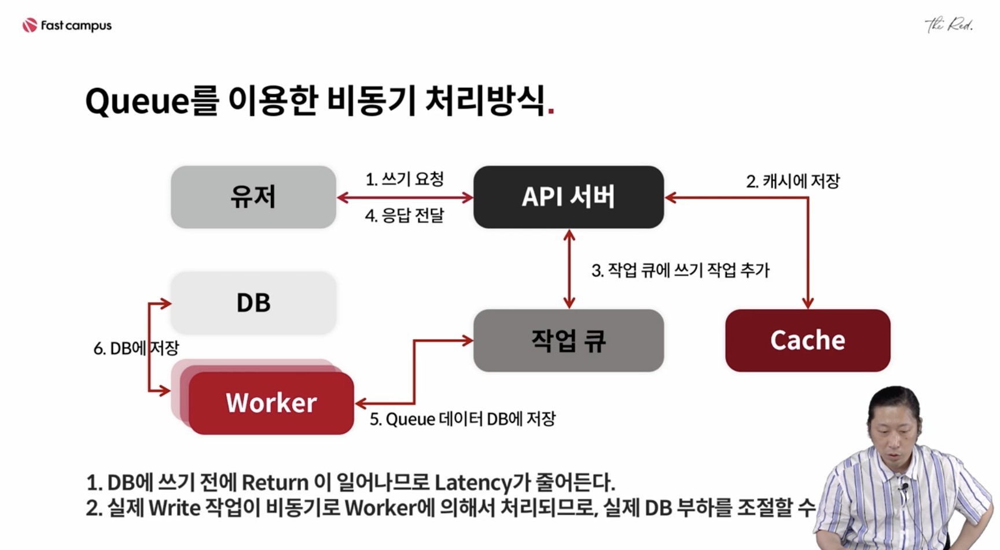

# 비동기 큐 사용

### 비동기 큐를 이용한 작업이 필요한 경우

API 호출 시 하나의 작업이 오래걸리는 경우

이로 인해 다른 작업들이 대기해야하는 경우 

대신, 응답을 바로 받지 않아도 되는 경우

```
* 보통 프로세스
	Request ~> Read ~> Write. 
		- 보통 Read는 캐시를 통해 하지만
		- 결국 마지막엔 대부분 DB Write 작업이 필요하다
		
* 웹 서버들이 늘어나면 DB에 부하도 함께 늘어난다
* 따라서 API 호출 시에 DB Write하는 부분의 부하조절이 어렵게된다. 
* 즉 API 호출 시에 DB Write를 하는 경우, API의 latency나 처리량은 결국 DB의 속도에 좌우하게 된다.
```

<br/>

#### API에서 DB에 바로 쓸 때의 문제점


- 유저가 많아지고 API 서버가 늘어날수록 DB에 붙는 스레드가 늘어난다. 
- 즉, 전체 스레드 수는 유저 수에 비례하게 된다. 
- DB 부하증가. 처리 느려짐

<br/>

### 비동기 큐를 이용한 "무거운 작업의 처리"

- DB 작업이 아니더라고 속도가 오래 걸리는 작업을 비동기로 후처리할 수 있다. 
  - 예) 파일업로드, 파일인코딩 작업
- 큐 워커 자체가 비동기라기보단, 큐를 이용해서 작업을 하기 때문에 비동기 큐. 

<br/>

#### 큐를 이용한 비동기 처리방식



DB를 쓰기전에 Return이 일어나므로 Latency가 줄어든다. 

실제 Write 작업이 비동기로 Worker에 의해 처리되므로 실제 DB부하를 조절할 수 있다. 

<br/>

(***) 

- 요청에 대한 응답을 주고 실제 DB저장은 큐를 통해 처리한다면
  - 바로반영이 아니기 때문에 유저들은 늦게 처리되는 것으로 인지할 수 있음
  - 이 문제의 해결법으로
    - 쓰기요청이오면 그 유저의 데이터를 캐시에 먼저 저장함
    - 유저의 읽기요청은 캐시를 통해 바로 처리됨
    - 실제 작업은 작업큐를 통해 DB에 저장
  - 발생할 수 있는 문제점
    - 캐시가 사라지면 캐시에 없는 데이터를 DB에서 읽으려고 시도
    - 이 경우 데이터 싱크가 잠깐 안맞는것처럼 보일 수 있음 
      - 작업 큐에 들어가면 워커에 따라 DB 업데이트가 발생할 것 
      - DB에 부담을 주지않는 선에서 워커를 늘리는 것으로 처리량을 조절할 수 있기 때문에 거의 바로 저장될거
- 즉, 많은 트래픽이 몰리는 경우 캐시에 업데이트를 하고 캐시에서 조회하게 함으로써 DB의 부하를 줄일 수 있다. 유저 수가 증가했을 때, 작업 큐로 들어온 요청은 워커 개수에 따라 우리가 부하처리를 조절할 수 있지만, 유저의 응답에서 바로 DB Write를 하게되면 처리 수가 그대로 증가하게되고 응답을 빠르게 줄 수 없음

<br/>

#### 비동기방식 특징 정리

- DB작업이 뒤에서 적정한 수준으로만 실행할 수 있으므로 DB 부하를 줄일 수 있다. 
- 워커 개수에 따라 작업처리량을 조절할 수 있다. 
  - 부하조절. 
  - 큐가 많이쌓이면 큐에대해 워커를 늘려서 처리
  - DB부하가 많이쌓이면 좀 느리더라도 워커를 줄임 
  - 큐가 중요. 
    - RabbitMQ, Redis를 이용한 SideKiq, Jesque, Kafka, .. 
    - 대규모 트래픽이 발생했을 때, 처리량을 조절하는 Back Pressure로 동작
      - 일정량만 처리. 
- 비동기로 동작하므로, 실제 DB처리가 늦어지므로, 내가 쓴 데이터를 바로 볼 수 없을 수도 있다. 
  - 이를 위해 실제로 서비스에서는 Cache에 먼저 저장해서, 
  - 해당결과를 서비스에서 볼 수 있도록한다. (Write-Back 형태)
  - Hot key 이슈에 대해서는 3장에서 설명하겠다
